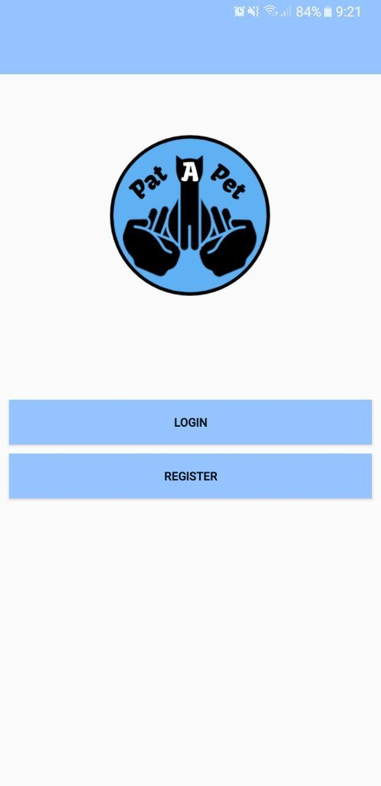

# Pat-A-Pet

An "easy" Android application made by us for CE2006, Software Engineering. This project deals with PetBacker issues. PetBacker is a platform that lets you show the world about your pet or hire trusted Pet Sitter for boarding, walking, grooming and daycare securely.  

## Getting Started

These instructions will get you a copy of the project up and running on your local machine for development and testing purposes. See deployment for notes on how to deploy the project on a live system.

### Prerequisites

Android Studio

```
Ensure that you 'Sync' the libraries
```

## Deployment

Make sure you set up your Firebase and sync it. It uses:
* Authentication
* Database
* Storage

## Built With

* Android Studio

## Screenshots


## Authors

* **Team SU** - Aleem, Viet, Nicholas, Riki, Aavan

## License

This project is licensed under the MIT License - see the [LICENSE.md](LICENSE.md) file for details

## Acknowledgments

* Hat tip to anyone whose code was used
* Inspiration
* Koddev (TheLegend27)

